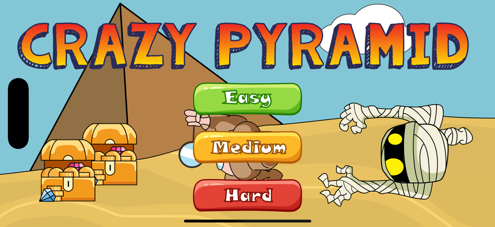
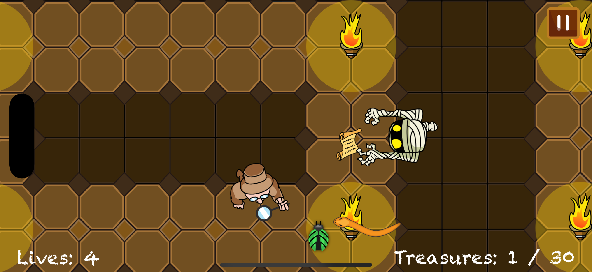

# Crazy Pyramid

Welcome to **Crazy Pyramid** – a fast-paced, action-packed mobile game where you play as an adventurous archaeologist exploring mysterious pyramids, dodging mummies, snakes, and beetles, and collecting treasures!

## 📸 Screenshots

| Main Menu                | Gameplay                  |
|-------------------------|--------------------------|
|  |  |


## 🏆 Game Features

- **Multiple Difficulties:** Choose from Easy, Normal, or Hard modes to match your skill level.
- **Dynamic Enemies:** Face off against mummies, snakes, and beetles, each with unique movement and behaviors.
- **Collect Treasures:** Gather as many treasures as you can while avoiding deadly traps and enemies.
- **Power-ups:** Find magical scrolls to boost your treasure collection.
- **Intuitive Controls:** Simple touch controls for smooth and engaging gameplay.
- **Vibrant Graphics & Animations:** Enjoy lively character animations and beautiful backgrounds.
- **Immersive Soundtrack:** Original music and sound effects for a captivating experience.
- **Multilingual Support:** Available in English, Simplified Chinese, and Traditional Chinese.

## 🎮 Gameplay

- **Objective:**
  - Collect the required number of treasures to win each level.
  - Avoid enemies and hazards to preserve your lives.
- **Controls:**
  - Tap and drag to move your archaeologist.
  - Use quick reflexes to dodge enemies and collect treasures.
- **Game Over:**
  - Lose all your lives, and it's game over! Try again to beat your high score.

## 📱 How to Play

1. Launch the game and select your preferred difficulty.
2. Guide your archaeologist through the pyramid, collecting treasures and avoiding enemies.
3. Use power-ups to your advantage and aim for the highest score!

## 🚀 Getting Started

This project is built with **Swift**, **SpriteKit**, and uses **CocoaPods** for dependency management. To run the game locally:

1. Clone the repository:
   ```bash
   git clone https://github.com/banghuazhao/crazy-pyramid.git
   cd crazy-pyramid
   ```
2. Install dependencies with CocoaPods:
   ```bash
   pod install
   ```
3. Open `Crazy Pyramid.xcworkspace` in Xcode:
   ```bash
   open "Crazy Pyramid.xcworkspace"
   ```
4. Build and run on your iOS device or simulator.

## 🤝 Contributing

Contributions, issues, and feature requests are welcome! Feel free to check the [issues page](https://github.com/banghuazhao/crazy-pyramid/issues).

## 📄 License

This project is licensed under the MIT License. See the [LICENSE](LICENSE) file for details.

---

Made with ❤️ by [Banghua Zhao](https://github.com/banghuazhao) 